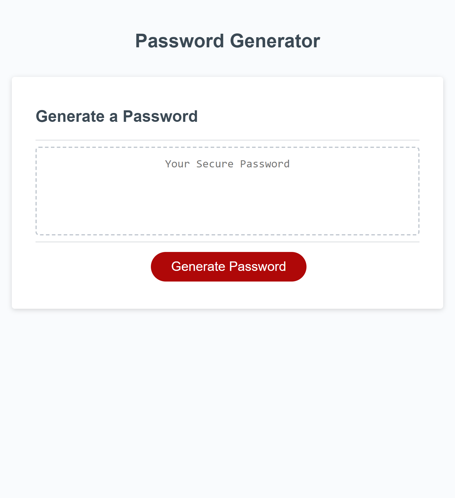

# Password Generator

## Description

Provide a short description explaining the what, why, and how of your project. Use the following questions as a guide:

- What was your motivation?
- Why did you build this project? (Note: the answer is not "Because it was a homework assignment.")
- What problem does it solve?
- What did you learn?
This project helps create different random passwords based on input. You can choose a different length, if you want uppercase, lowercase, numeric, and/or special characters.
This is great if you need a new random password and can help users create a password that doesn't contain personal information. I learned more about javascript functions and how to use them in order to achieve diffferent goals. I also learned alert, return, and confirm messages. I also was able to really get a good understanding about if,else statements.

## Usage

In order to use this go to the following website: https://akemp24.github.io/Password-Generator/
Click on generate password and follow the prompts. (It should ask password length, if you want lowercase, uppercase, numeric, and/or special characters). Note you must choose at least one special character or else it will ask you to include.
Once you've answered the prompts it should show a random password in the box shown.

Website should look similar to below:

    
